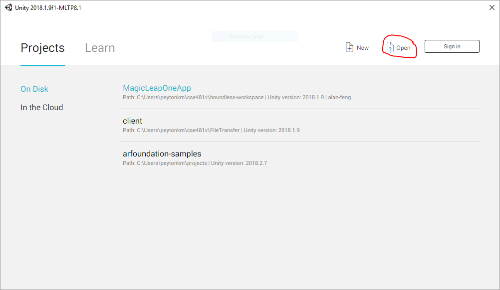
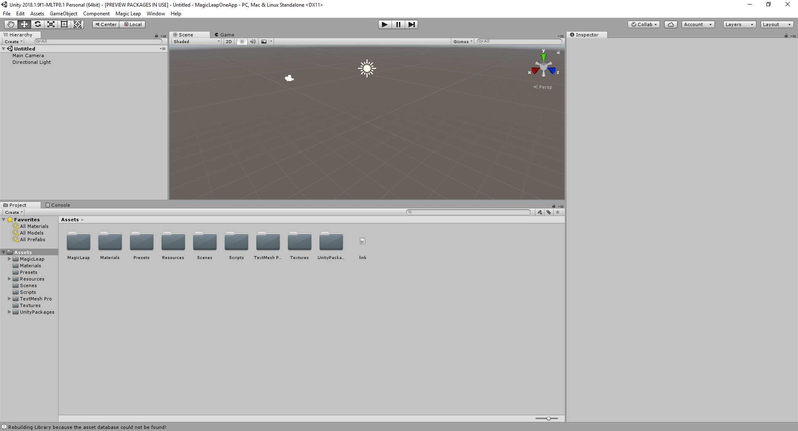
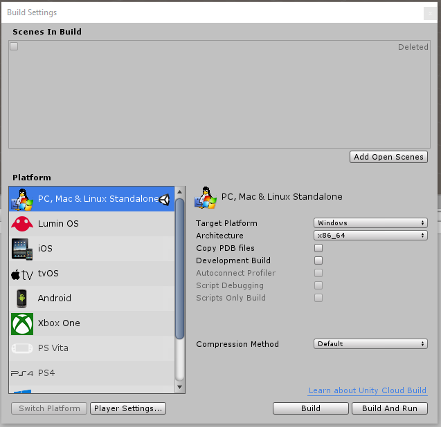
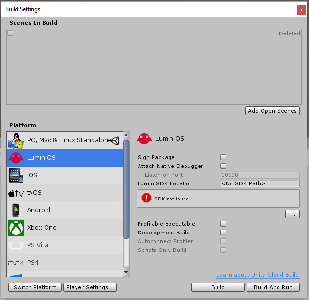
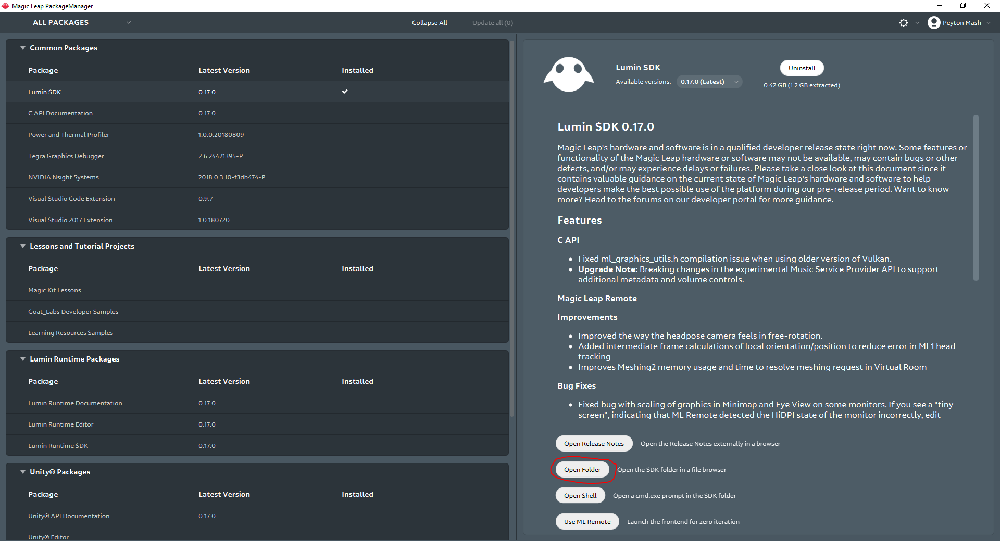
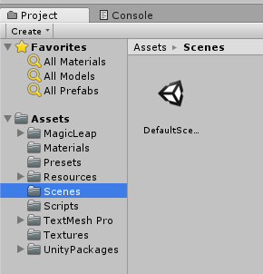
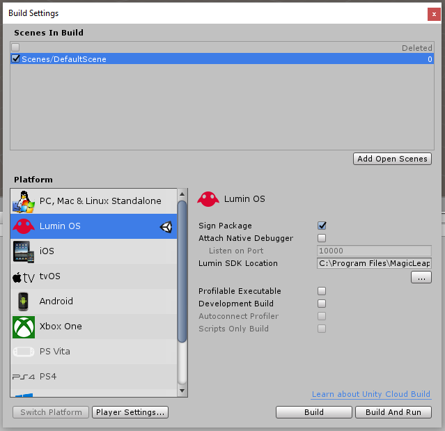
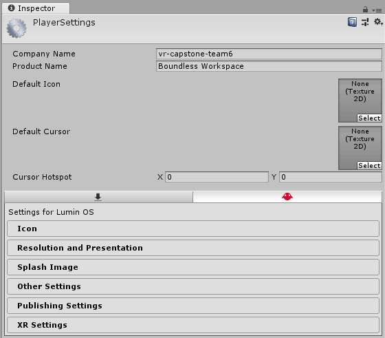
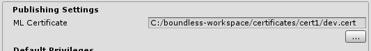

# Boundless Workspace

[TODO]

## Build and Deployment

1. Start the Magic Leap Technical Preview edition of the Unity editor.

2. Locate and open the "boundless-workspace" directory of this repo with Unity.

   

   Once the project loads, the editor will appear. It should look something like this:

   

3. Locate the menu bar at the top and choose "File > Build Settings...". The following window should appear:

   

4. Under "Platform", choose Lumin OS. You'll see the following:

   

5. Click the "Switch Platform" button. You may see a pop-up window with a progress bar. If so, wait for it to finish.

6. Check "Sign Package" (i.e., make sure it has a check mark).

7. Input the Lumin SDK location. You can find this by opening the Magic Leap Package Manager (this is a separate program from Unity), navigating to "Lumin SDK" under "Common Packages", and then clicking the "Open Folder" button on the right.

    

    In the file explorer window that opens, copy the path to the current directory. You can do this by first pressing the [F4] key to bring focus to the address bar. After releasing [F4], use the [Ctrl-A] shortcut to select the address, and then use the [Ctrl-C] shortcut to copy the address.

8. Add the scene to the build. In the bottom of the editor, there's a "Project" tab. Under "Assets" is a folder called "Scenes". Click on it and you'll see the following:

    

    Drag and drop "DefaultSce..." over into the Build Settings window in the box under "Scenes In Build". The window should now look like this:

    

9. Click the "Player Settings..." button, and then close the Build Settings window. On the right side of the editor, you should see the following:

    

10. Click "Publishing Settings". You should see something like the following:

    

11. Change the ML Certificate to an actual certificate. At the time of writing, this repo includes a certificate under certificates/cert1 that you can use.

12. Double click "DefaultSce..." to open it in the editor.

13. Turn on the Magic Leap One headset (and its controller) and plug the headset into your computer. Wait until the app-chooser menu appears.

14. If the app (or any app with bundle ID "edu.uw.cs.481v.team6") is already installed but was signed with a different certificate, you need to uninstall it first. You can do this by opening the Magic Leap Package Manager, selecting "Lumin SDK" (like in the previous step) and clicking the "Open Shell" button. In the terminal that opens, enter "mldb uninstall edu.uw.cs.481v.team6".

15. From the menu bar, choose "File > Build and Run". Choose a name for the mpk file if asked to. Then, the app should start on the headset. You'll need to start the server and set up the "Send to" option to transfer files onto the headset though.

## Starting the Server

TODO: these directions need more work.

1. Install Node.js (and npm, which should come bundled with it).

2. Open a terminal in the server directory of this repo.

3. Run "npm install" to pull in the server's dependencies.

4. Run "node server.js" to start the server on port 3000

5. Allow inbound TCP connections for Node.js through Windows Firewall.

## Setting up the "Send to" Option

TODO: these directions need more work.

1. Install Node.js and Python.

2. If it's not set already, set the association for .pyw files so they're double-click-executable.

3. Navigate to the "send-to" directory of this repo in the file explorer.

4. Right click "python-script.pyw" and create a shortcut.

5. Rename the shortcut "Boundless workspace".

6. Cut the shortcut (keyboard shortcut: [Ctrl-X]).

7. Navigate to the address bar by pressing [F4].

8. Clear the current address and enter "shell:sendto".

9. Paste the shortcut into the directory you end up in. You now have the new "Send to" option in your file explorer context menu when you right click on a select of files.
